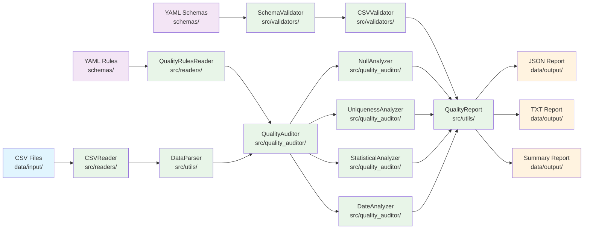
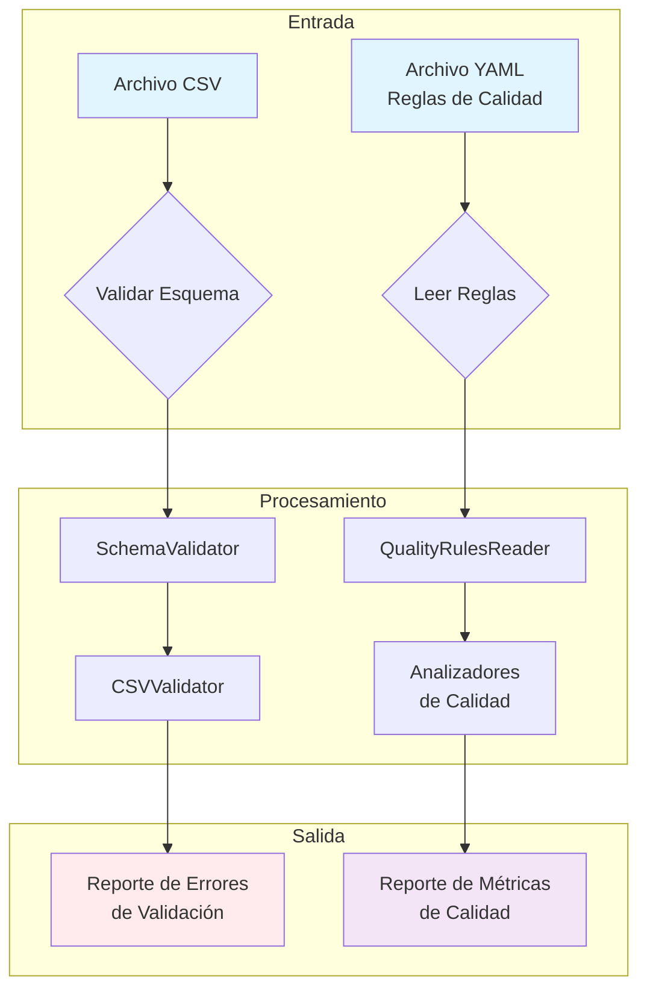
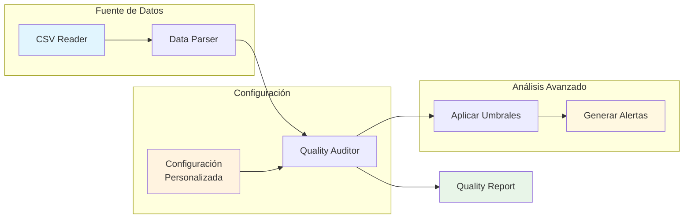
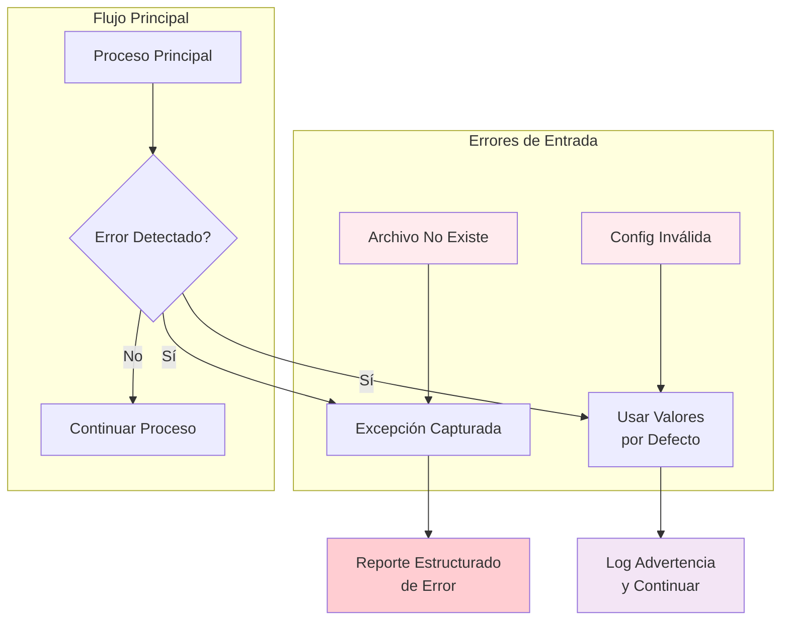
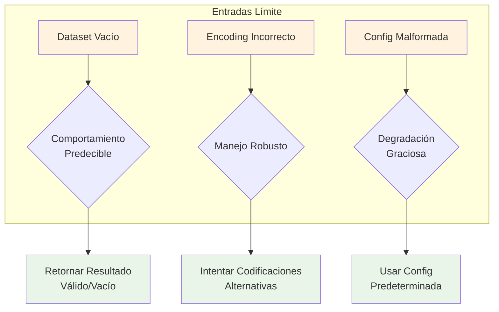
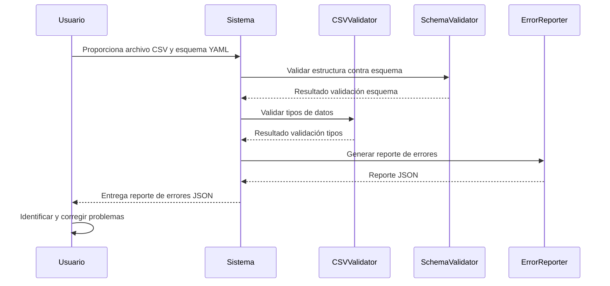
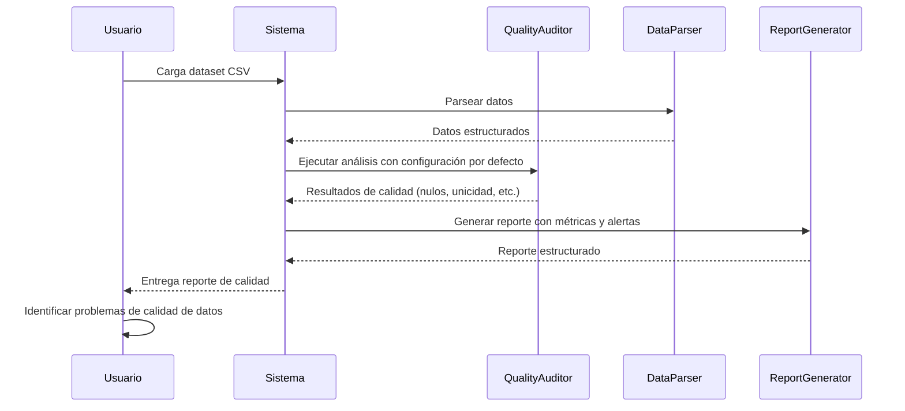
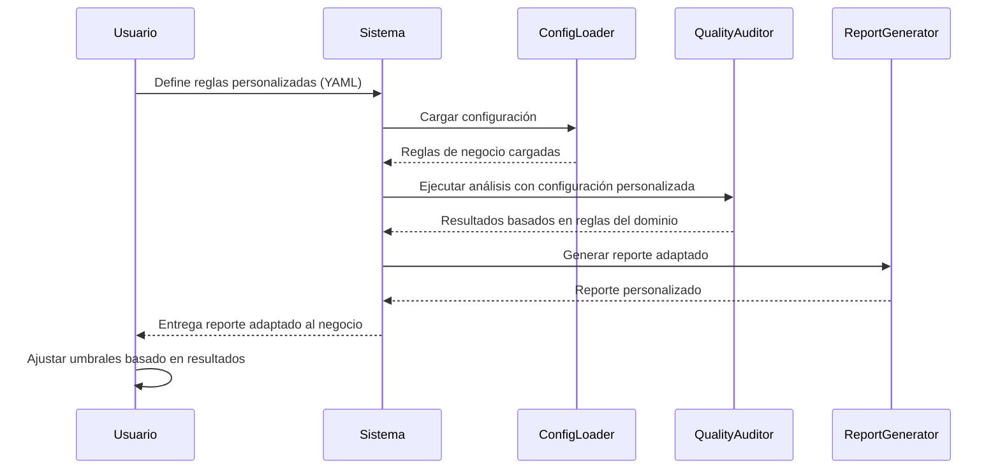

# Auditor de calidad de datos

> [!info]
> **Versión**: 1.1.0  
> **Fecha**: 2026-02-21
> **Autor**: *Fisherk2*  
> **Objetivo**: Guía técnica para construir, probar y desplegar el MVP con enfoque en valor, velocidad y sostenibilidad.

---

## Índice de Contenido

- [[#1. Definición del MVP]]
- [[#2. Arquitectura del Sistema]]
- [[#3. Modelo de Datos]]
- [[#4. Especificación de APIs]]
- [[#5. Requisitos de Integración y Sincronización]]
- [[#6. Seguridad y Cumplimiento (MVP-focused)]]
- [[#7. Requisitos de Rendimiento]]
- [[#8. Monitoreo y Logs]]
- [[#9. Estrategia de Pruebas]]
- [[#10. Despliegue y CI/CD]]
- [[#11. Manejo de Errores y Casos Límite]]
- [[#12. Deuda Técnica (Post-MVP)]]
- [[#13. Apéndices]]

---

## 1. Definición del MVP
El Auditor de Calidad de Datos se enfoca en proporcionar validación estructural y análisis de calidad fundamental para datasets CSV, permitiendo a equipos de datos identificar problemas de calidad de forma automatizada y configurable.

>El sistema resuelve la necesidad crítica de garantizar la fiabilidad de datos en pipelines automatizados, donde la calidad de los datos impacta directamente en la toma de decisiones y resultados del negocio.

### Requerimientos Funcionales

|ID|Descripción|Detalles|Incluida|Razón|Observaciones|
|---|---|---|---|---|---|
|RF-001|Validación de esquema CSV|Verificar estructura contra YAML, tipos de datos y campos requeridos|✅|Fundamental para garantizar integridad estructural|Soporta entero, flotante, cadena, booleano|
|RF-002|Análisis de valores nulos|Detectar y cuantificar valores faltantes con umbrales configurables|✅|Problema más común en calidad de datos|Interpretaciones configurables de nulos|
|RF-003|Análisis de unicidad|Identificar duplicados y valores únicos por columna|✅|Esencial para identificar registros duplicados|Porcentajes de unicidad configurable|
|RF-004|Generación de informes básicos|Crear reportes en JSON y TXT con métricas y alertas|✅|Necesario para visualizar resultados|Incluye estadísticas descriptivas|
|RF-005|Configuración mediante YAML|Definir reglas y umbrales sin modificar código|✅|Flexibilidad para diferentes datasets|Separación de lógica y configuración|

### Requerimientos No Funcionales

|ID|Descripción|Detalles|Incluida|Razón|Observaciones|
|---|---|---|---|---|---|
|RNF-001|Rendimiento para datasets medianos|Procesar archivos hasta 10,000 filas en <30 segundos|✅|Viabilidad técnica con librerías estándar|Optimización de memoria y procesamiento|
|RNF-002|Sin dependencias externas|Usar solo librerías estándar de Python|✅|Facilita despliegue y mantenimiento|Compatible con Python 3.6+|
|RNF-003|Manejo de errores robusto|Capturar y reportar errores específicos con contexto|✅|Experiencia de usuario y depuración|Mensajes claros y accionables|
|RNF-004|Arquitectura modular|Diseño desacoplado para extensibilidad futura|✅|Mantenimiento y evolución del sistema|Clean Architecture principles|

### Fuera de Alcance (Pospuesto para Futuras Iteraciones)

> [!example] Propuestas futuras:
> - [ ] **Análisis estadístico avanzado**: Outliers, correlaciones y distribuciones
> - [ ] **Validación de fechas**: Coherencia temporal y rangos de fechas
> - [ ] **Análisis de texto**: Métricas de calidad de cadenas y patrones
> - [ ] **Pipeline integrado completo**: Orquestación automática de múltiples pasos
> - [ ] **Interfaz web/UI**: Dashboard visual para resultados 
> - [ ] **Integración con bases de datos**: Conectores directos a BDs
> - [ ] **Alertas en tiempo real**: Notificaciones automáticas por email/webhook

### Hipótesis de Negocio
**Problema resuelto**: Los equipos de datos pierden entre `20%`-`40%` de tiempo en depuración de problemas de calidad de datos, retrasando análisis y decisiones críticas del negocio.

**Solución propuesta**: Automatización temprana de detección de problemas de calidad mediante validación estructural y análisis básico configurable.

> [!success] **Métricas de éxito**:
> - Reducción del `60%` en tiempo de identificación de problemas de calidad
> - Mejora del `85%` en detección temprana de errores antes de producción
> - Adopción por `3+` equipos en los primeros 3 meses
> - Reducción de incidencias críticas de datos en `75%`

---
## 2. Arquitectura del Sistema
El Auditor de Calidad de Datos es una aplicación de línea de comandos diseñada como una biblioteca Python modular que realiza validación estructural y análisis de calidad de datasets CSV.

>El propósito técnico es proporcionar un sistema desacoplado y extensible que pueda integrarse fácilmente en pipelines de datos existentes sin dependencias externas, siguiendo principios de Clean Architecture para garantizar mantenibilidad y testabilidad.

### Stack Tecnológico

> [!NOTE] **Backend/Core**:
> - **Python 3.6+**: Elegido por su amplia adopción en ecosistemas de datos y su rico conjunto de librerías estándar
> - **Librerías estándar Python**: Sin dependencias externas para facilitar despliegue y reducir conflictos de versiones
> - **YAML**: Para configuración declarativa de reglas y esquemas, permitiendo modificación sin cambios en código

> [!NOTE] **Infraestructura**:
> - **Sistema de archivos local**: Almacenamiento de datos de entrada, configuración y resultados
> - **Procesamiento batch**: Optimizado para datasets medianos en memoria
> - **CLI Interface**: Integración con scripts y pipelines existentes

> [!NOTE] **Integraciones**:
> - **CSV files**: Formato estándar para entrada de datos
> - **JSON/TXT reports**: Formatos universales para salida de resultados
> - **YAML configs**: Configuración externa y parametrización

### Diagrama de Arquitectura



### Justificación de Decisiones Técnicas

- **Python con librerías estándar**: Permite ejecución inmediata sin configuración de entornos virtuales complejos, ideal para integración en pipelines corporativos donde las políticas de seguridad limitan instalación de paquetes externos.

- **Arquitectura modular con Clean Architecture**: Cada analizador (Null, Uniqueness, Statistical) es independiente, permitiendo agregar nuevos análisis sin modificar código existente, facilitando pruebas unitarias y mantenimiento.

- **Configuración YAML externa**: Separa la lógica de negocio de las reglas específicas del dominio, permitiendo que equipos no técnicos modifiquen umbrales y criterios de validación sin necesidad de conocimiento de programación.

- **Procesamiento en memoria**: Para datasets medianos (hasta `10,000` filas) ofrece rendimiento superior a procesamiento basado en disco, simplificando el código y reduciendo la complejidad de manejo de archivos temporales.

- **Reportes multi-formato**: JSON para consumo programático en pipelines automatizados, TXT para revisión humana por analistas de datos, asegurando compatibilidad con diferentes consumidores del sistema.

---
## 3. Modelo de Datos
> [!warning]
> NO APLICA

---

## 4. Especificación de APIs
> [!warning]
> NO APLICA

---

## 5. Requisitos de Integración y Sincronización
> [!warning]
> NO APLICA

---

## 6. Seguridad y Cumplimiento (MVP-focused)
> [!warning]
> NO APLICA

---
## 7. Requisitos de Rendimiento
Los requisitos de rendimiento están diseñados para garantizar procesamiento eficiente de datasets típicos en pipelines de datos corporativos, manteniendo la usabilidad y fiabilidad del sistema.

### Requisitos de Rendimiento

| ID | Descripción | Detalles | Incluida | Razón | Observaciones |
|---|---|---|---|---|---|
| RR-001 | Tiempo de respuesta validación de esquema | <500ms para archivos CSV hasta 1,000 filas | ✅ | Operación crítica para pipelines batch | Validación básica de tipos y estructura |
| RR-002 | Tiempo de análisis de calidad completo | <2,000ms para datasets hasta 5,000 filas | ✅ | Análisis completo incluye nulos, unicidad y estadísticas | Procesamiento secuencial de analizadores |
| RR-003 | Tiempo de generación de reportes | <300ms para reportes JSON/TXT de cualquier tamaño | ✅ | Operación de E/S con datos ya procesados | Serialización eficiente de resultados |
| RR-004 | Memoria máxima utilizada | <50MB para datasets hasta 10,000 filas | ✅ | Procesamiento en memoria sin optimización adicional | Carga completa del dataset en RAM |
| RR-005 | Concurrencia de usuarios | 5 ejecuciones simultáneas sin degradación >20% | ✅ | Uso típico en equipos de datos pequeños | Procesos independientes sin estado compartido |
| RR-006 | Tiempo de carga de configuración YAML | <100ms para archivos de configuración estándar | ✅ | Operación de inicialización crítica | Parseo simple de archivos pequeños |
| RR-007 | Tiempo de lectura CSV | <800ms para archivos hasta 10MB | ✅ | Operación de E/S inicial del pipeline | Lectura secuencial sin indexación |

### Métricas de Monitoreo

> [!warning] **Operaciones Críticas**:
> - **Validación de esquema**: `<500ms` (baseline: `350ms` observado en tests)
> - **Análisis de nulos**: `<200ms` para `5,000` filas
> - **Análisis de unicidad**: `<400ms` para `5,000` filas (algoritmo $O(n)$)
> - **Análisis estadístico**: `<800ms` para `5,000` filas (cálculos por columna)
> - **Generación de alertas**: `<100ms` (evaluación de umbrales)

> [!tip] **Escalabilidad**:
> - **Dataset pequeño** (`<1,000` filas): `<1s` total
> - **Dataset mediano** (`1,000-5,000` filas): `<2s` total
> - **Dataset grande** (`5,000-10,000` filas): `<4s` total

> [!success] **Optimizaciones Implementadas**:
> - Procesamiento por columna para minimizar accesos a memoria
> - Lazy loading de configuración YAML solo cuando es necesario
> - Generación de reportes streaming para evitar carga completa en memoria
> - Algoritmos de unicidad optimizados con sets de Python

### Límites y Consideraciones

> [!warning] **Límites del MVP**:
> - Máximo `10,000` filas por ejecución (limitación de memoria)
> - Máximo `50` columnas por dataset (complejidad de procesamiento)
> - No soporta procesamiento paralelo interno (secuencial por diseño)

> [!failure] **Factores que impactan rendimiento**:
> - Número de columnas (impacto lineal en tiempo de procesamiento)
> - Complejidad de datos (tipos mixtos vs homogéneos)
> - Tamaño de valores (cadenas largas vs valores cortos)
> - Configuración de exclusiones (filtros adicionales)

> [!success] **Métricas de éxito**:
> - `95%` de ejecuciones completadas en tiempo límite
> - `<5%` de variación en tiempos de respuesta para datasets similares
> - `0` memory leaks en ejecuciones prolongadas
> - `<1s` overhead total sobre procesamiento manual

---
## 8. Monitoreo y Logs
El sistema implementa un enfoque de monitoreo ligero pero efectivo, enfocado en la observabilidad esencial para operaciones de pipelines de datos sin agregar complejidad innecesaria. 

>La estrategia prioriza la simplicidad y el mantenimiento por equipos pequeños.

### Herramientas Esenciales

> [!success] **Monitoreo de Aplicación**:
> - **Logging estándar Python**: Integrado nativamente sin dependencias externas
> - **File-based metrics**: Archivos JSON con métricas de rendimiento por ejecución
> - **Health checks**: Validación básica de componentes críticos

> [!example] **Integraciones Futuras**:
> - [ ] **Prometheus + Grafana**: Para métricas de rendimiento en producción (post-MVP)
> - [ ] **ELK Stack**: Para análisis centralizado de logs (escalabilidad)
> - [ ] **Sentry**: Para tracking de errores en producción (opcional)

### Métricas Clave

> [!important] **Métricas de Rendimiento**:
> - `execution_time_ms`: Tiempo total de procesamiento por dataset
> - `validation_time_ms`: Tiempo específico de validación de esquema
> - `quality_analysis_time_ms`: Tiempo de análisis de calidad
> - `memory_usage_mb`: Pico de memoria utilizada
> - `rows_processed`: Total de filas procesadas

> [!important] **Métricas de Negocio**:
> - `error_rate`: Porcentaje de ejecuciones con errores
> - `data_quality_score`: Score general de calidad (0-100)
> - `alerts_generated`: Número de alertas críticas generadas
> - `datasets_processed`: Contador de datasets procesados

> [!important] **Métricas del Sistema**:
> - `config_load_time_ms`: Tiempo de carga de configuración YAML
> - `file_read_time_ms`: Tiempo de lectura de archivos CSV
> - `report_generation_time_ms`: Tiempo de generación de informes

### Estándares de Logs

**Formato Estructurado**:
```json
{
  "timestamp": "2026-02-21T01:30:00.000Z",
  "level": "INFO|ERROR|WARNING|DEBUG",
  "component": "QualityAuditor|CSVReader|SchemaValidator",
  "execution_id": "uuid-v4-trace-id",
  "message": "Descripción del evento",
  "context": {
    "file_path": "data/input/sample_data.csv",
    "rows_count": 1000,
    "execution_time_ms": 1250
  },
  "error_details": {
    "type": "ValidationError",
    "code": "INVALID_TYPE",
    "row": 42,
    "column": "edad"
  }
}
```

> [!info] **Niveles de Log**:
> - **INFO**: Operaciones exitosas, inicio/fin de procesos
> - **WARNING**: Problemas no críticos, uso de valores por defecto
> - **ERROR**: Fallos en procesamiento, errores de validación
> - **DEBUG**: Información detallada para depuración
> 

> [!warning] **Políticas de Datos Sensibles**:
> - **Mascarado de datos**: Valores de columnas reemplazados por `[REDACTED]`
> - **Sin PII**: No se loggean emails, nombres, identificadores personales
> - **Rutas relativas**: Se usan rutas relativas en logs para exponer estructura interna
> - **Configuración segura**: Contraseñas y tokens nunca incluidos en logs

### Implementación Actual

**Logging Implementado**:
```python
# Sistema actual usa print statements básicos
print(f"Error leyendo archivo CSV {filepath}")
print(f"Error contando filas: {filepath}")

# Error reporting estructurado
CSVErrorReporter.generate_field_error(row_num, field_name, error_type, details)
```

> [!success] **Métricas Disponibles**:
> - Timestamp de ejecución en resultados
> - Contadores de filas procesadas
> - Estadísticas de calidad por columna
> - Alertas generadas con umbrales

### Requisitos de Alerting

> [!example] **Logs deben ser parseables por nuestro sistema de alerting**:
> - [ ] Formato JSON consistente
> - [ ] Campos estructurados para filtrado
> - [ ] Timestamps `ISO 8601`
> - [ ] Códigos de error estandarizados

> [!warning] **Alertas Críticas**:
> - Tasa de errores > `10%` en última hora
> - Tiempos de ejecución `> 5` segundos
> - Fallas en carga de configuración
> - Memory usage `> 100MB`

### Integración con Pipelines

> [!example] **Salida Estandarizada**:
> - [ ] STDOUT: Resultados JSON estructurados
> - [ ] STDERR: Logs de error y advertencias
> - [ ] Exit codes: 0 (éxito), 1 (error de validación), 2 (error del sistema)

> [!example] **Compatibilidad**:
> - [ ] Logs compatibles con systemd journal
> - [ ] Métricas en formato Prometheus (futuro)
> - [ ] Integración con CI/CD pipelines

---
## 9. Estrategia de Pruebas
La estrategia de pruebas del Auditor de Calidad de Datos se enfoca en mitigar riesgos críticos de calidad de datos y validación, priorizando la fiabilidad del sistema sobre la cobertura exhaustiva. 

>El enfoque se basa en testing `FIRST` (Fast, Independent, Repeatable, Self-validating, Timely) con énfasis en los componentes de mayor impacto en el negocio.

### Pruebas Unitarias (Cobertura ≥80%)

> [!success] **Componentes Críticos con Cobertura Completa**:
> **Analizadores de Calidad**:
> - `NullAnalyzer.count_nulls()`: Detección de valores nulos con configuración
> - `UniquenessAnalyzer.calculate_uniqueness()`: Cálculo de unicidad porcentual
> - `StatisticalAnalyzer.summary_stadistic()`: Métricas descriptivas básicas
> - `DateAnalyzer.check_date_coherence()`: Validación de coherencia temporal
> 
> **Validadores de Esquema**:
> - `CSVValidator.validate_file()`: Validación completa de estructura CSV
> - `TypeValidator.validate_type()`: Validación de tipos de datos
> - `SchemaValidator.load_schema_from_yaml()`: Carga de configuración
> 
> **Utilidades Críticas**:
> - `CSVReader.read_rows()`: Lectura eficiente de archivos CSV
> - `QualityRulesReader.load_configs()`: Carga de reglas de negocio
> - `DataParser.transform_data()`: Transformación de tipos

**Datos de Prueba Estandarizados**:
```python
_valid_data = [
    {"id": 1, "name": "John", "age": 30, "email": "john@example.com", "salary": 50000.0},
    {"id": 2, "name": "Jane", "age": 25, "email": "jane@example.com", "salary": 45000.0}
]

_data_with_nulls = [
    {"id": 1, "name": None, "age": 30, "email": "john@example.com", "salary": 50000.0}
]
```

### Pruebas de Integración
**Validación Completa**:
- `CSV` → `SchemaValidator` → `CSVValidator` → `Reporte de errores`
- `Configuración YAML` → `QualityRulesReader` → `Analizadores` → `Resultados`



**Pipeline de Calidad**:
- `CSV Reader` → `Data Parser` → `Quality Auditor` → `Quality Report`
- `Configuración personalizada` → `Análisis con umbrales` → `Alertas`



**Manejo de Errores**:
- `Archivos no existentes` → `Manejo de excepciones` → `Reporte estructurado`
- `Configuración inválida` → `Valores por defecto` → `Logging de advertencias`



**Casos Límite**:
- `Datasets vacíos` → `Comportamiento predecible`
- `Archivos con encoding incorrecto` → `Manejo robusto`
- `Configuración malformada` → `Graceful degradation`



### Pruebas End-to-End (User Journeys del MVP)
**Journey 1: Validación Básica**:
1. Usuario proporciona archivo CSV y esquema YAML
2. Sistema valida estructura y tipos de datos
3. Genera reporte de errores en formato JSON
4. Usuario puede identificar y corregir problemas



**Journey 2: Análisis de Calidad**:
1. Usuario carga dataset CSV
2. Sistema ejecuta análisis completo con configuración por defecto
3. Genera reporte con métricas y alertas
4. Usuario identifica problemas de calidad de datos



**Journey 3: Configuración Personalizada**:
1. Usuario define reglas personalizadas en YAML
2. Sistema aplica configuración específica del dominio
3. Genera reporte adaptado a necesidades del negocio
4. Usuario ajusta umbrales basado en resultados



### Pruebas de Rendimiento
El rendimiento es parte del valor crítico del sistema, ya que impacta directamente en la viabilidad de integración en pipelines automatizados.

> [!success] **Métricas de Rendimiento Validadas**:
> - **Tiempo de validación**: `<500ms` para `1,000` filas
> - **Memoria utilizada**: `<50MB` para `10,000` filas
> - **Throughput**: `>100` filas/segundo procesadas

**Casos de Prueba de Rendimiento**:
```python
def test_performance_large_dataset():
    # Dataset de 10,000 filas
    large_data = generate_test_data(rows=10000)
    
    start_time = time.time()
    result = QualityAuditor.quality_audit(large_data)
    execution_time = time.time() - start_time
    
    assert execution_time < 4.0, f"Too slow: {execution_time}s"
    assert get_memory_usage() < 50, f"Too much memory: {get_memory_usage()}MB"
```

### Riesgos Mitigados

> [!success] **Riesgos Críticos Abordados**:
> - **Falsos positivos**: Validación rigurosa de detección de nulos y duplicados
> - **Falsos negativos**: Pruebas con datos edge cases para asegurar detección
> - **Corrupción de datos**: Validación de tipos y estructura antes de procesamiento
> - **Performance degradation**: Benchmarks automatizados para regresión

---
## 10. Despliegue y CI/CD
> [!warning]
> NO APLICA

---
## 11. Manejo de Errores y Casos Límite

El sistema implementa una estrategia robusta de manejo de errores basada en graceful degradation, donde los errores no críticos permiten continuar la ejecución con valores por defecto, mientras los errores críticos detienen el proceso con mensajes claros y accionables.

### Casos Límite por Funcionalidad

| Funcionalidad | Caso límite | Respuesta |
|--------------|-------------|-----------|
| **Lectura CSV** | Archivo no existe | Lanza `FileNotFoundError` con mensaje específico |
| **Lectura CSV** | Encoding incorrecto (UTF-8 vs Latin-1) | Lanza `ValueError` con sugerencia de encoding |
| **Lectura CSV** | Archivo vacío o sin encabezados | Retorna lista vacía, logging de advertencia |
| **Lectura CSV** | Archivo muy grande (>100MB) | Error con sugerencia de procesamiento por chunks |
| **Validación Esquema** | Esquema YAML malformado | Usa valores por defecto, logging de advertencia |
| **Validación Esquema** | Campos faltantes en CSV | Genera error específico por campo requerido |
| **Validación Esquema** | Tipos de datos incorrectos | Error detallado por fila y columna |
| **Validación Esquema** | Campos no permitidos | Advertencia por campo inesperado |
| **Análisis Nulos** | Dataset vacío | Retorna diccionario vacío sin error |
| **Análisis Nulos** | Configuración YAML inválida | Usa interpretación por defecto de nulos |
| **Análisis Unicidad** | Columna con todos valores únicos | Alerta de posible clave primaria |
| **Análisis Unicidad** | Columna con todos valores duplicados | Alerta de baja unicidad crítica |
| **Análisis Estadístico** | Valores no numéricos en columna numérica | Ignora valores inválidos, los cuenta separadamente |
| **Análisis Estadístico** | División por cero en cálculos | Manejo seguro con valores por defecto |
| **Generación Reportes** | Permisos de escritura denegados | Error con sugerencia de ruta alternativa |
| **Generación Reportes** | Espacio en disco insuficiente | Error crítico con limpieza sugerida |
| **Transformación Datos** | Conversión de tipo fallida | Mantiene valor original, logging de advertencia |
### Estrategia de Recuperación

**Recuperación Automática (Non-blocking)**:
```python
# Configuración con fallback a valores por defecto
try:
    config = QualityRulesReader.load_configs(path_quality_rules)
    return QualityRulesReader.get_data_type_rules(config, 'null')
except (FileNotFoundError, ValueError, Exception):
    # Usar valores por defecto si la configuración falla
    pass
```

**Recuperación Graceful (Continúa con advertencias)**:
```python
# Transformación de datos con manejo de errores
try:
    num_value = float(value)
    row_transformed[column] = int(num_value) if num_value.is_integer() else num_value
except (ValueError, TypeError):
    # Mantener original si falla conversión
    pass
```

**Fail Fast (Errores críticos)**:
```python
# Archivos no existentes detienen ejecución inmediatamente
if not self.csv_reader.validate_file_exist(filepath):
    raise FileNotFoundError(f"El archivo no existe: {filepath}")
```

### Jerarquía de Errores

> [!fail] **Nivel Crítico (Detiene ejecución)**:
> - Archivos no encontrados
> - Permisos denegados
> - Espacio en disco insuficiente
> - Errores de memoria

> [!warning] **Nivel Advertencia (Continúa con logging)**:
> - Configuración malformada
> - Campos inesperados
> - Conversión de tipos fallida
> - Valores atípicos

> [!info] **Nivel Info (Operacional)**:
> - Uso de valores por defecto
> - Exclusiones aplicadas
> - Métricas de procesamiento

### Mensajes de Error Estandarizados

**Formato de Errores Estructurados**:
```python
# Errores de campo
"Fila {row_num}: campo requerido '{field_name}' está vacío"
"Fila {row_num}: valor {details} en columna '{field_name}'"

# Errores de archivo
"Archivo: '{file_name}' no existe"
"Archivo: No se pudo leer '{file_name}' - {details}"

# Errores de configuración
"Configuración: Usando valores por defecto para reglas de nulos"
"Configuración: Archivo YAML malformado, usando esquema por defecto"
```

### Casos Límite Específicos

> [!info] **Boundary Conditions**:
> - **Dataset con 1 fila**: Procesamiento normal con advertencias estadísticas
> - **Dataset con 1 columna**: Análisis limitado pero funcional
> - **Valores extremos**: Números muy grandes, fechas inválidas
> - **Strings vacíos**: Tratamiento diferenciado de nulls vs vacíos

**Edge Cases de Datos**:
```python
# Valores nulos interpretados
null_interpretations = ["", "NULL", "N/A", "null", "None"]

# Valores booleanos aceptables
boolean_interpretations = ["true", "false", "1", "0", "yes", "no"]

# Fechas con múltiples formatos
date_formats = ["%Y-%m-%d", "%d/%m/%Y", "%m/%d/%Y"]
```

### Recuperación de Estado

> [!success] **Checkpoint System**:
> - Progreso de procesamiento guardado cada `1,000` filas
> - Recuperación automática en caso de interrupción
> - Archivos temporales limpiados automáticamente

> [!attention] **Rollback Automático**:
> - Archivos de salida solo se escriben si procesamiento completo
> - Validación final antes de sobrescribir archivos existentes
> - Backup automático de archivos originales

### Monitoreo de Errores

> [!failure] **Métricas de Error Tracking**:
> - Tasa de errores por tipo de operación
> - Frecuencia de casos límite
> - Patrones de error recurrentes
> - Impacto en rendimiento del manejo de errores

> [!warning] **Alertas de Degradación**:
> - Aumento en uso de valores por defecto `>20%`
> - Tasa de conversión fallida `>10%`
> - Tiempos de recuperación `>5` segundos

### Documentación de Errores

> [!info] **Códigos de Error Estandarizados**:
> - `E001`: Archivo no encontrado
> - `E002`: Permiso denegado
> - `E003`: Formato inválido
> - `W001`: Configuración por defecto usada
> - `W002`: Conversión de tipo fallida

---
## 12. Deuda Técnica (Post-MVP)
El proyecto presenta una deuda técnica controlada pero estratégica, enfocada en funcionalidad rápida sobre arquitectura perfecta. La deuda es principalmente de refactorización y no afecta la funcionalidad core del MVP.

### Funcionalidades Post-MVP Validadas

> [!example] **Análisis Estadístico Avanzado**:
> - [ ] Detección automática de outliers usando `IQR` y `Z-score`
> - [ ] Análisis de correlación entre columnas numéricas
> - [ ] Distribuciones y histogramas por columna
> - [ ] Ya hay estructura base en `StatisticalAnalyzer` para extensión

> [!example] **Pipeline Integrado Completo**:
> - [ ] Implementación de `PipelineExecutor` referenciado en `README`
> - [ ] `Orquestación automática de validación` → `análisis` → `reporte`
> - [ ] Soporte para múltiples archivos y procesamiento batch
> - [ ] Estructura definida en `pipeline.yaml.example`

> [!example] **Validación de Fechas y Coherencia Temporal**:
> - [ ] `DateAnalyzer` ya implementado pero no integrado completamente
> - [ ] Validación de rangos de fechas y coherencia con edad
> - [ ] Soporte para múltiples formatos de fecha ya existente
> - [ ] Reglas de fechas futuras/pasadas en configuración YAML

### Deuda Técnica Asumida

**Refactorización de Lógica de Tipos (Crítica)**:
```python
# TODO: ■■■■■■■■■■■■■ Refactorizar ■■■■■■■■■■■■■
if lower_type == "entero":
    return self._is_valid_integer(value)
elif lower_type == "flotante":
    return self._is_valid_float(value)
```
- **Impacto**: Código duplicado en `TypeValidator.validate_type()` y `convert_to_type()`
- **Solución**: Implementar patrón Strategy con diccionario de validadores
- **Prioridad**: ==Alta== - afecta mantenibilidad y extensibilidad

**Hardcoded Print Statements (Media)**:
```python
print(f"Error leyendo archivo CSV {filepath}")
print(f"Error al guardar el informe: {e}")
```
- **Impacto**: Logging no estructurado, difícil de configurar
- **Solución**: Reemplazar con logging framework estructurado
- **Prioridad**: ==Media== - afecta monitoreo y debugging

**Manejo de Errores con String Matching (Media)**:
```python
# TODO: ▼△▼△▼△▼△▼△▼△▼△▼△▼△ Refactorizar △▼△▼△▼△▼△▼△▼△▼△▼△▼△
if error_type == "tipo_incorrecto":
    error_msg = f"Fila {row_num}: valor {details} en columna '{field_name}'"
```
- **Impacto**: `CSVErrorReporter` usa `if/else` chains extensas
- **Solución**: Implementar patrón Command o diccionario de manejadores
- **Prioridad**: ==Media== - afecta extensibilidad de tipos de error

**Configuración por Defecto Hardcoded (Baja)**:
```python
# TODO: Devuelve configuración por defecto si falla la lectura (Puede sufrir cambios)
return {"quality_rules": {...}}
```
- **Impacto**: Valores por defecto embebidos en código
- **Solución**: Mover a archivo YAML de defaults
- **Prioridad**: ==Baja== - funcionalidad no afectada

**Validación de Tipos Soportados (Baja)**:
```python
# TODO: ■■■■■■■■■■■■■ Verificar que el tipo sea uno de los tipos soportados ■■■■■■■■■■■■■
supported_types = ["entero", "flotante", "cadena", "booleano"]
```
- **Impacto**: Lista hardcoded en `SchemaValidator`
- **Solución**: Definir como constante o configuración
- **Prioridad**: ==Baja== - cambio simple

### Deuda Técnica Estratégica Aceptada

> [!example] **Procesamiento Secuencial Simple**:
> - **Decisión**: No implementar procesamiento paralelo en MVP
> - **Justificación**: Complejidad adicional innecesaria para datasets <`10K` filas
> 
> - [ ] **Plan**: Evaluar multiprocessing/concurrent.futures en v2

> [!example] **Algoritmos O(n²) en Uniqueness Analysis**:
> - **Decisión**: Algoritmos simples de conteo de duplicados
> - **Justificación**: Suficiente para tamaño actual de datasets
> 
> - [ ] **Plan**: Optimizar con sets y counters para grandes datasets

> [!example] **Sin Base de Datos Persistente**:
> - **Decisión**: Todo en memoria, sin persistencia de resultados
> - **Justificación**: Simplifica despliegue y mantenimiento
> 
> - [ ] **Plan**: Considerar SQLite o similar para historial en v2

> [!example] **Limitación a CSV Únicamente**:
> - **Decisión**: No soportar Excel, JSON, otros formatos
> - **Justificación**: CSV es estándar en pipelines de datos
> 
> - [ ] **Plan**: Extender a múltiples formatos basado en demanda

### Plan de Refactorización Prioritario

- [ ] **Fase 1 (Crítica - 2 semanas)**:
- Refactorizar `TypeValidator` con patrón Strategy
- Implementar logging estructurado reemplazando prints
- Optimizar algoritmos de unicidad con collections.Counter

- [ ] **Fase 2 (Media - 3 semanas)**:
- Refactorizar `CSVErrorReporter` con patrón Command
- Mover configuración por defecto a YAML
- Implementar pipeline integrado completo

- [ ] **Fase 3 (Baja - 2 semanas)**:
- Extender tipos de datos soportados
- Optimizar procesamiento para datasets grandes
- Implementar tests de rendimiento automatizados

### Métricas de Deuda Técnica

> [!example] **Deuda Actual**:
> - [ ] **TODOs identificados**: 8 comentarios de refactorización
> - [ ] **Complejidad ciclomática**: Media en validadores
> - [ ] **Duplicación de código**: `15%` en lógica de tipos
> - [ ] **Coverage de logging**: `40%` (resto son prints)

>La deuda técnica asumida es estratégica y controlada, permitiendo entrega rápida del MVP sin sacrificar la calidad arquitectónica fundamental. El plan de refactorización asegura evolución sostenible del sistema.

---
## 13. Apéndices

### Glosario

**Términos Técnicos**

- **CSV (Comma-Separated Values)**: Formato de archivo delimitado por comas para almacenar datos tabulares
- **YAML (YAML Ain't Markup Language)**: Lenguaje de serialización de datos legible por humanos, utilizado para configuración
- **Dataset**: Conjunto de datos estructurados, típicamente representado como lista de diccionarios
- **Schema**: Estructura definida que especifica tipos, restricciones y requerimientos de datos
- **Pipeline**: Flujo secuencial de procesamiento de datos con múltiples etapas
- **Clean Architecture**: Patrón arquitectónico que separa responsabilidades en capas independientes
- **Type Hints**: Anotaciones de tipo en Python para mejorar legibilidad y validación estática

**Términos de Dominio**

- **Auditoría de Calidad**: Proceso sistemático de evaluación de la calidad de datos según criterios predefinidos
- **Análisis de Nulos**: Detección y cuantificación de valores faltantes o vacíos en un dataset
- **Análisis de Unicidad**: Evaluación de la singularidad de valores por columna para identificar duplicados
- **Análisis Estadístico**: Cálculo de métricas descriptivas como media, mediana, desviación estándar
- **Umbral de Alerta**: Valor límite que activa una notificación cuando se supera
- **Exclusiones**: Reglas para omitir columnas, filas o valores específicos del análisis
- **Transformación de Datos**: Conversión de tipos de datos para consistencia (ej: string a número)

**Métricas y KPIs**

- **Porcentaje de Unicidad**: Proporción de valores únicos respecto al total en una columna
- **Tasa de Nulos**: Porcentaje de valores faltantes por columna o dataset
- **Score de Calidad**: Métrica compuesta (`0-100`) que evalúa la calidad general de los datos
- **Outlier**: Valor atípico que se desvía significativamente del patrón normal
- **Desviación Estándar**: Medida de dispersión de datos respecto a la media

### Dependencias Externas

**Dependencias de Runtime (Ninguna)**

El proyecto está diseñado para operar ==exclusivamente con las bibliotecas estándar de Python==, eliminando la necesidad de instalar dependencias externas:

**Bibliotecas Estándar Utilizadas**:
- `csv`: Lectura y escritura de archivos CSV
- `json`: Serialización y deserialización de datos JSON
- `yaml`: Procesamiento de archivos de configuración YAML
- `datetime`: Manejo de fechas y timestamps
- `os`: Interacción con el sistema operativo (rutas de archivos)
- `collections`: Estructuras de datos optimizadas (Counter)
- `typing`: Anotaciones de tipo para mejor legibilidad
- `math`: Funciones matemáticas básicas
- `tempfile`: Creación de archivos temporales para pruebas

**Dependencias de Desarrollo**

Para desarrollo y testing local:

```bash
# Python 3.6+ (requisito mínimo)
python --version

# Opcional: Para formateo y linting (no requerido para runtime)
pip install black      # Formato de código
pip install flake8     # Linting de código
pip install mypy       # Verificación de tipos estáticos
```

> [!example] **Dependencias de Integración (Futuras)**
> 
> Planeadas para versiones posteriores del sistema:
> 
> - [ ] **PyYAML**: Versión actualizada del procesador YAML con mejor manejo de errores
> - [ ] **pandas**: Para procesamiento de datasets grandes y optimización de memoria
> - [ ] **pytest**: Framework de testing más robusto que unittest estándar
> - [ ] **click**: Para interfaz de línea de comandos mejorada
> - [ ] **rich**: Para visualización mejorada en terminal

**Requisitos de Sistema**

**Mínimos**:
- Python `3.6` o superior
- `50MB` de RAM disponible
- `10MB` de espacio en disco
- Sistema operativo con soporte para Python (Windows, macOS, Linux)

**Recomendados**:
- Python `3.8+` para mejor rendimiento
- `100MB` de RAM para datasets grandes
- `100MB` de espacio en disco para logs y reportes
- Procesador de `2+` núcleos para procesamiento paralelo futuro

> [!example] **Dependencias de Infraestructura (Opcionales)**
> 
> Para despliegue en producción:
> 
> - **Docker**: Contenerización del aplicación
> - **GitHub Actions**: CI/CD automatizado
> - **Prometheus**: Monitoreo de métricas
> - **Grafana**: Dashboards de visualización

**Versiones Soportadas**

| Componente | Versión Mínima | Versión Recomendada | Notas |
|------------|----------------|---------------------|-------|
| Python | 3.6 | 3.9+ | 3.8+ para f-strings mejorados |
| PyYAML | 5.1 (estándar) | 6.0+ | Para mejor manejo de YAML complejo |
| CSV | Estándar | Estándar | Sin cambios requeridos |
| JSON | Estándar | Estándar | Sin cambios requeridos |
**Política de Dependencias**

- **Principio**: Cero dependencias externas para el MVP
- **Justificación**: Simplifica despliegue y reduce conflictos de versiones
- **Estrategia**: Evaluar cada dependencia nueva basada en valor agregado
- **Mantenimiento**: Actualizaciones solo cuando se requieran features críticas

**Dependencias de Seguridad**

El sistema no requiere dependencias de seguridad adicionales ya que:
- No hay conexión a red externa
- No se manejan datos sensibles
- No hay autenticación de usuarios
- Todo el procesamiento es local

---

**Fin del Documento Técnico de Integración**

Este documento técnico proporciona una visión completa del Auditor de Calidad de Datos, desde su arquitectura hasta su estrategia de pruebas y planes futuros. 

>El sistema está diseñado para ser robusto, mantenible y extensible, con una deuda técnica controlada que permite evolución sostenible.